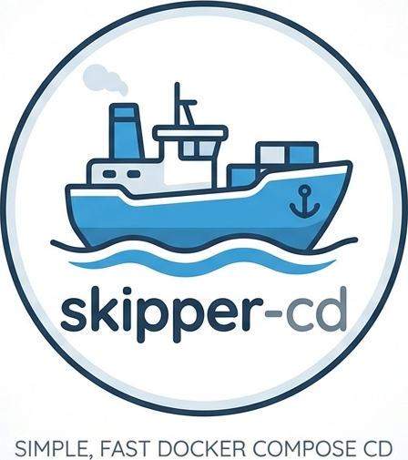

<p align="center">
  
</p>

<h1 align="center">skipper-cd</h1>

<p align="center"><i>Simple, fast Docker Compose CD</i></p>
<br>

A lightweight Docker Compose CD tool that listens for push webhooks, maintains a local clone of a Git repository, and deploys changed Docker Compose stacks. Unchanged stacks are skipped automatically.

Supported webhook signatures: **Gitea** (`X-Gitea-Signature`) and **GitHub/Forgejo** (`X-Hub-Signature-256`).

> **Note:** Only Gitea webhooks have been tested so far. GitHub and Forgejo support should work but is untested — feedback welcome via [GitHub Issues](https://github.com/polandy/skipper-cd/issues).

## How It Works

On each incoming webhook (or on startup), skipper-cd:

1. Pulls the latest commits from the configured repository.
2. Computes SHA-256 hashes for each stack's `docker-compose.yml`, any declared `env_files`, and the global `vars_file`.
3. Compares the current hashes against the hashes from the previous deployment.
4. Skips stacks whose files have not changed.
5. For changed stacks, runs `docker compose pull` followed by `docker compose up -d --remove-orphans`.
6. Stops any containers listed in `on_demand_containers` (see below) so that an on-demand scheduler can take over lifecycle management.
7. Logs the git diff of each changed file (relative to the last deployed commit).

Concurrent webhook requests and the startup deploy are serialized by a deployment lock. If a deploy is already in progress, subsequent requests wait for it to finish before starting their own sync+deploy cycle.

## Configuration

The configuration file is a YAML file passed via the `-config` flag (default: `/etc/skipper/skipper.yml`).

### Full Example

```yaml
repo_url: ssh://git@gitea.example.com/user/nixos-config.git
repo_dir: /var/lib/skipper/repo        # optional, this is the default
branch: main                            # optional, default: main
vars_file: /etc/skipper/vars.env        # optional
command_timeout_seconds: 300            # optional, default: 300
stacks_base_dir: /var/lib/skipper/repo/modules
webhook_secret: "your-secret-here"
port: 8080
metrics_port: 9120

stacks:
  - name: traefik
    env_files:
      - /run/secrets/rendered/skipper/compose.env

  - name: gitea
    env_files:
      - /run/secrets/rendered/skipper/compose.env

  # Override working_dir for stacks not directly under stacks_base_dir
  - name: apc-monitor
    working_dir: /var/lib/skipper/repo/modules/monitoring/apc-monitor
    env_files:
      - /run/secrets/rendered/skipper/compose.env
```

### Top-level Fields

| Field | Type | Required | Default | Description |
|---|---|---|---|---|
| `repo_url` | string | yes | — | URL of the Git repository to clone and pull (supports SSH and HTTPS). |
| `repo_dir` | string | no | `/var/lib/skipper/repo` | Local directory where the repository is cloned. skipper-cd manages this directory independently of any live checkout. |
| `branch` | string | no | `main` | Git branch to track. Used for `git clone --branch` and `git reset --hard origin/<branch>`. |
| `vars_file` | string | no | — | Path to a `KEY=VALUE` env file containing non-secret values available during every `docker compose` invocation (see [vars_file](#vars_file)). Changes to this file trigger redeployment of all stacks. |
| `command_timeout_seconds` | int | no | `300` | Maximum number of seconds a single shell command (`docker compose pull/up`, `git clone/fetch`) is allowed to run before being killed. |
| `stacks_base_dir` | string | no | — | Base directory prepended to a stack's `name` to derive its working directory when `working_dir` is not set. Avoids repeating long paths across stacks. |
| `webhook_secret` | string | no | — | HMAC-SHA256 secret used to validate incoming webhook payloads (supports Gitea and GitHub/Forgejo signatures). When empty, signature validation is skipped (not recommended for production). |
| `port` | int | no | `8080` | Port on which the webhook HTTP server listens. Exposes `/webhook` and `/healthz`. |
| `metrics_port` | int | no | `9120` | Port on which the Prometheus metrics HTTP server listens. Exposes `/metrics`. |
| `stacks` | list | yes | — | List of Docker Compose stacks to manage (see [Stack Fields](#stack-fields)). |

### Stack Fields

Each entry under `stacks` configures one Docker Compose stack.

| Field | Type | Required | Default | Description |
|---|---|---|---|---|
| `name` | string | yes | — | Name of the stack. Used as the working directory name when `working_dir` is absent and `stacks_base_dir` is set. Also used as the key in the deploy state file. |
| `working_dir` | string | no | `<stacks_base_dir>/<name>` | Absolute path to the directory containing `docker-compose.yml`. Takes precedence over `stacks_base_dir`. |
| `env_files` | list of strings | no | — | Absolute paths to `KEY=VALUE` env files whose contents are injected into the `docker compose` environment. These files are also hash-tracked: a change to any declared env file triggers a redeploy of that stack. |
| `watch_dirs` | list of strings | no | — | Absolute paths to directories whose contents are recursively hash-tracked. Any file change inside a watched directory triggers a redeploy of that stack. Useful for stacks with auxiliary configuration directories (e.g. Grafana provisioning). |
| `on_demand_containers` | list of strings | no | — | Container names to stop after a successful deployment. Use this for containers managed by an on-demand scheduler (e.g. Sablier): skipper-cd starts them via `docker compose up`, then immediately stops them so the scheduler can control their lifecycle. |

### `vars_file`

The `vars_file` is a `KEY=VALUE` env file containing non-secret configuration values (e.g. a domain name) that should be available as environment variables during `docker compose` execution. This is useful for `${VAR}` substitutions in Docker Compose files without storing the values in a secrets manager.

**Example `vars.env`:**
```env
DOMAIN=example.com
INTERNAL_IP=192.168.1.10
```

**Environment variable precedence** (highest wins):
1. `env_files` entries (stack-level, typically secrets)
2. `vars_file` values (global non-secret values)
3. Process environment (`os.Environ()`)

The `vars_file` is included in hash tracking — any change to it triggers a redeploy of all stacks.

## Prometheus Metrics

skipper-cd exposes the following metrics on the `/metrics` endpoint:

| Metric | Type | Description |
|---|---|---|
| `skipper_webhooks_received_total` | counter | Total number of webhook requests received, labelled by `status`. |
| `skipper_deploys_triggered_total` | counter | Total number of stack deploys triggered, labelled by `stack`. |
| `skipper_deploys_skipped_total` | counter | Total number of stack deploys skipped (no changes), labelled by `stack`. |
| `skipper_deploy_errors_total` | counter | Total number of failed deploys, labelled by `stack`. |
| `skipper_last_deploy_timestamp` | gauge | Unix timestamp of the last successful deploy, labelled by `stack`. |

## Docker

> **Note:** Running skipper-cd as a Docker container has not been tested yet. If you try it, feedback and bug reports are welcome via [GitHub Issues](https://github.com/polandy/skipper-cd/issues).

```yaml
services:
  skipper:
    image: ghcr.io/polandy/skipper-cd:latest
    restart: unless-stopped
    ports:
      - "8080:8080"   # webhook
      - "9120:9120"   # metrics
    volumes:
      - /var/run/docker.sock:/var/run/docker.sock
      - ./skipper.yml:/etc/skipper/skipper.yml:ro
      - skipper-data:/var/lib/skipper

volumes:
  skipper-data:
```

The Docker socket mount is required — skipper-cd uses it to manage compose stacks. The `skipper-data` volume persists the cloned repository and deploy state across restarts.

## NixOS Module

skipper-cd ships with a NixOS module at `nixosModules.default`.

### Flake Input

```nix
# flake.nix
inputs = {
  skipper-cd.url = "path:/path/to/skipper-cd";   # or a git+https URL
  skipper-cd.inputs.nixpkgs.follows = "nixpkgs";
};
```

Pass it through `specialArgs` so the module can access the flake:

```nix
nixosConfigurations.myhost = lib.nixosSystem {
  specialArgs = { inherit skipper-cd; };
  modules = [ ./configuration.nix ];
};
```

### Importing the Module

```nix
# configuration.nix (or any imported module)
{ skipper-cd, ... }:
{
  imports = [ skipper-cd.nixosModules.default ];

  services.skipper-cd = {
    enable    = true;
    package   = skipper-cd.packages.x86_64-linux.default;
    configFile = "/run/secrets/skipper.yml";  # path to the rendered skipper.yml
  };
}
```

The module creates the state directory at `/var/lib/skipper`, adds `git`, `docker`, and `docker-compose` to the service `PATH`, and runs skipper-cd as a hardened systemd service under the `root` user (Docker socket access via `SupplementaryGroups = [ "docker" ]`).

### Service Options

| Option | Type | Default | Description |
|---|---|---|---|
| `enable` | bool | `false` | Enable the skipper-cd systemd service. |
| `package` | package | — | The skipper-cd derivation to use. |
| `configFile` | path | — | Absolute path to `skipper.yml`. |
| `stateDir` | string | `/var/lib/skipper` | Directory for deploy state and the repository clone. |

### Recommended Pattern: Self-Registering Stacks

To avoid maintaining a manual stack list that can diverge from the services actually enabled, define a `services.skipper-cd.stacks` option in the skipper-cd wrapper module and have each service module register itself:

**`modules/skipper-cd/default.nix`** — defines the option and generates the config:

```nix
{ config, lib, skipper-cd, ... }:
let
  stackType = lib.types.submodule {
    options = {
      name                 = lib.mkOption { type = lib.types.str; };
      working_dir          = lib.mkOption { type = lib.types.str; default = ""; };
      watch_dirs           = lib.mkOption { type = lib.types.listOf lib.types.str; default = []; };
      on_demand_containers = lib.mkOption { type = lib.types.listOf lib.types.str; default = []; };
    };
  };
in {
  imports = [ skipper-cd.nixosModules.default ];

  options.services.skipper-cd.stacks = lib.mkOption {
    type        = lib.types.listOf stackType;
    default     = [];
    description = "Stacks managed by skipper-cd. Each service module appends itself here when enabled.";
  };

  config = lib.mkIf config.services.skipper-cd.enable {
    services.skipper-cd = {
      package    = skipper-cd.packages.x86_64-linux.default;
      configFile = config.sops.templates."skipper/skipper.yml".path;
    };
  };
}
```

**`modules/gitea/default.nix`** — self-registration inside the existing `mkIf` block:

```nix
config = lib.mkIf config.services.gitea-docker.enable {
  # ... existing gitea config ...

  services.skipper-cd.stacks = [{ name = "gitea"; }];
};
```

**`modules/monitoring/default.nix`** — with `watch_dirs`:

```nix
services.skipper-cd.stacks = [{
  name       = "monitoring";
  watch_dirs = [ "/var/lib/skipper/repo/modules/monitoring/grafana-data/provisioning" ];
}];
```

**`modules/monica/default.nix`** — with `on_demand_containers` and `working_dir`:

```nix
services.skipper-cd.stacks = [{
  name                 = "monica";
  working_dir          = "/etc/nixos/modules/monica";
  on_demand_containers = [ "monica-app" "monica-db" ];
}];
```

Because the list is only populated when a service's `enable = true`, disabled services are automatically absent from `skipper.yml`. There is no risk of skipper-cd deploying a stack for a service that has been turned off.

#### `working_dir` and Docker Compose Project Identity

When a NixOS systemd service manages a Docker Compose stack (via `WorkingDirectory = /etc/nixos/modules/<name>`), Docker labels containers with `com.docker.compose.project.working_dir=/etc/nixos/modules/<name>`. skipper-cd by default runs stacks from its own clone at `/var/lib/skipper/repo/modules/<name>` — a different path, even though the directory basename (and therefore the project name) is identical.

Docker Compose uses `project.working_dir` to match running containers to a project. When the paths differ, skipper-cd does not recognise the containers created by systemd as belonging to its deployment and tries to create new ones, causing a name conflict:

```
Container <name>  Creating
Error response from daemon: Conflict. The container name "/<name>" is already in use
```

Setting `working_dir` to the NixOS modules path aligns both systemd and skipper-cd on the same Docker Compose project identity, eliminating the conflict. This is the recommended approach for any stack that is managed by both a NixOS systemd service and skipper-cd.

## State File

Deployment state is persisted at `/var/lib/skipper/state.yaml`. It stores the per-file hashes from the last successful deployment of each stack, as well as the Git commit SHA at the time of that deployment.

```yaml
last_deployed_commit: abc123def456...
stacks:
  traefik:
    /var/lib/skipper/repo/modules/traefik/docker-compose.yml: 9f86d081...
  gitea:
    /var/lib/skipper/repo/modules/gitea/docker-compose.yml: aabbccdd...
    /run/secrets/rendered/skipper/compose.env: 11223344...
```

If the state file is absent or cannot be parsed (e.g. after a fresh install or corruption), all stacks are redeployed on the next run.
